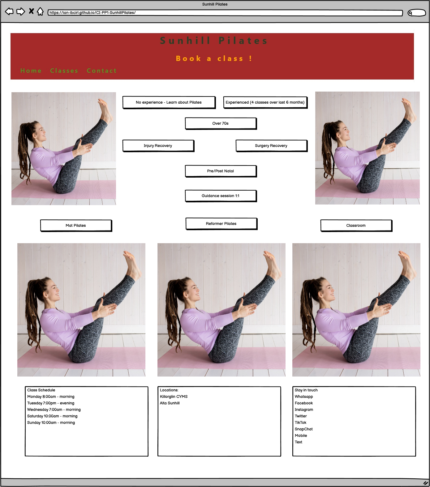
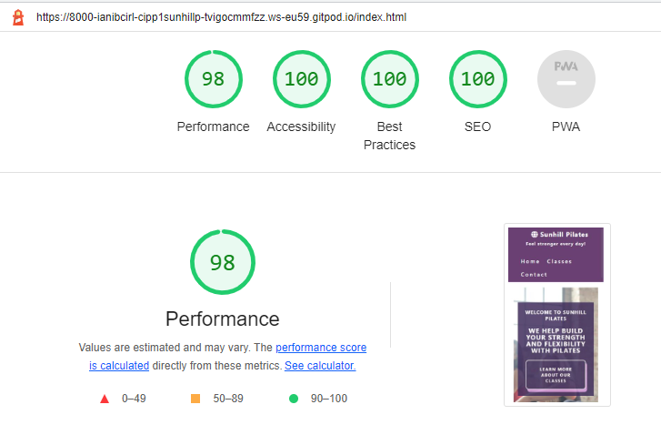

## About my project
## Code Institute Portfolio Project 1 covering HTML and CSS 
## Website for Sunhill Pilates

<h1 align="center">Sunhill Pilates Website</h1>

Welcome to my Code Institute Portfolio Project 1 covering HTML and CSS - Website for Sunhill Pilates.

My goals are to:
1) develop a website which 
2) informs the user about the main advantages of Pilates, while 
3) also building trust in the instructors, and then 
4) informing them of what they will need
5) calling them to action in filling out the contact form to 
6) arrange an initial class 1:1, or 
7) in a classroom for experienced participants,
8) with the option to view a video of a sample class,
9) finally informing them of classroom hours, location and social media links.

See here for the current website: https://ian-ibcirl.github.io/CI-PP1-SunhillPilates/

To run a frontend (HTML, CSS, Javascript only) application in Gitpod, in the terminal, type: `python3 -m http.server`

Sunhill Pilates is a site that advertises and informs the audience about a fictitious fitness business. The business primarily sells classroom Pilates instruction and also a limited range of smaller classes for one to four people. The site is targeted toward people who want to learn Pilates and commit to their exercise on an ongoing basis. Sunhill Pilates also provides a small number of introductory classes and informational videos for clients and visitors "on the go" or at home. The business also has regular classes with informal gatherings afterwards, for anyone who wants to stay and socialise. People are just getting used to social gatherings again, especially among older clients who may not have the circle of friends from the past. The primary USP is the appeal, satisfaction and quality of the instruction. The site will be useful for people who want to check out the range of classes available, the location and classroom hours, as well as the references of the instructors.

This file also contains some important information about the project, including Gitpod and the extensions we use. 

The last update to this file was: **9th August 2022** 

## Index
* [User Experience (UX)](#user-experience-ux) 
* [Features](#features)
* [Design](#design)
* [Technologies Used](#technologies-used)
* [Testing](#testing)
* [Deployment](#deployment)
* [Gitpod Reminders](#gitpod-reminders)
* [Credits](#credits)
* [Release History ](#release-history)
* [Data Privacy](#data-privacy)

## User Experience (UX)

-   ### User stories

    -   #### A. First Time Visitor Goals

        1. As a First Time Visitor, I want to understand the main purpose of the site and learn more about the organisation.
        2. As a First Time Visitor, I want to be able to easily find where the organisation is located.
        3. As a First Time Visitor, I want to be able to easily navigate throughout the site to find content.
        4. As a First Time Visitor, I want to be able to easily navigate to and view a list of classes, requirements and goals.
        5. As a First Time Visitor, I want to be able to easily find out more about who is running the business, and figure out any pre-requisites for participating.
        6. As a First Time Visitor, I want to be able to view sample videos of instruction or pre-requisites.

    -   #### B. Returning Visitor Goals

        1. As a Returning Visitor, I want to be able to access and view the menu quickly and easily.
        2. As a Returning Visitor, I want to be able to check class times quickly and easily.
        3. As a Returning Visitor, I want to be able to contact the instructor or business owner to ask questions or give feedback.
        4. As a Returning Visitor, I want to be able to view videos of instruction.

    -   #### C. Frequent User Goals
        1. As a Frequent User, I want to be able to sign-up easily for more classes, discounts and check on my progress.

## Features
* [Back to index](#index) 
* [Back to top of README.md](#about-my-project) 

### Existing Features

-   __F01 Navigation Bar__

    - The navigation bar has an initial consistent look and placement on the main page, with all three pages (when completed) of the website ready to support easy navigation.  As well as the initial Home page, the site will include a simple Logo, Classes and Contact links and should be responsive on multiple screen sizes.  For smaller screens, such mobile devices, the Home, Classes and Contact links move to under the Logo.

-   __F02 Hero Section & Business services__
    - The section on the main page is a first hook for the user. 
It contains a short description of the business and classes,
so that the user learns what classes are on offer.
Buttons services of the business and additional information about the
busines.
This page also includes photos for additional visual effect.  

- __F03 Classes__
    - This page contains the business's list of classes and is divided into types of class. 

- __F04 Online Video__
    - On this page is a short sample video to encourage the user to build their interest in paid for classes.

- __F05 Pilates contact form__
    - This page has a contact form that allows you to send a message and respond to information requested.  
The form also has a Google map that shows where the classes and the business are located.

- __F06 404 Page__
    - The 404 page is the page for displaying the HTTP 404 error message. 
It informs the user that there is no page at the URL entered.  
This page has all the navigation, footer and a button so that the user can quickly return to the home page or other working page.

- __F07 Footer__
    - The footer will be featured on all three pages and will be identical on each page making it easy to use.  It will contain three sections :

        - Class Times - by putting the class times in the footer on each page allows the user to quickly and easily find this information and begin planning their participation.

        - Address - the address of this business is important to the user in order for them to plan their use of the services, and get some idea of the quality of the facility and surrounding location for parking - the address in the footer also links to Google Maps.

        - Keep in contact - links to social media sites associated with the instructor and the training organisation make it easy for the user to keep connected, and see who else is participating.  The links will open in a new tab to allow easy navigation for the user. Sunhill Pilates is a ficticious company, so the links currently just go to the social media main websites for now.

- __How the features correlate with the User Stories__

    - The User Stories in the [User Experience (UX)](#user-experience-ux) part of this document are numbered and categorised into groups A (first time visitor), B (returning visitor) and C (frequent visitor).  The existing features are listed above as F01 to F0X 
    
    The charts in the [Testing visitor stories](#testing-visitor-stories) section of this document shows how the user stories correlate to features, showing features that support the user stories.

### Future Features 
* [Back to index](#index) 
* [Back to top of README.md](#about-my-project) 

- __Timeline__
    - A 'Timeline' page could be added to provide more information experience and certification of the instructor(s) for clients who would like to know more about the origins of the business, its values and its interaction with the community.

- __Video Playback__
    - A 'Video Playback' page could be added to provide further sample videos and actual class content for clients on the go or working from home or under lockdown. Some content would only be accessible to registered clients with a current subscription.

- __Privacy/Security__
    - A 'Security' page could be added to provide commonly expected assurances to clients. Some content would only be accessible to registered clients with a current subscription, so it would eventually me necessary to collect more identifying information for legitimate use cases, as expected by GDPR and other related legislation, in various jurisdictions. All subsequent information sent to the client will have the option to opt out, delete personally identifiable information, access account information for a subject access request, and delete the account on request.

- __Navigation bar improvements__
    - The functionality of the navigation bar will be extended to make it available to the user without scrolling.
    - A 'Contact via Whatsapp' option or QR code may also be helpful.

## Design
* [Back to index](#index) 
* [Back to top of README.md](#about-my-project) 

-   ### Imagery
    -   I am working to find images to choose that will be eye-catching, informative and bright.  The colours in the images will be chosen to help convey a sense of mindfulness, health and wellbeing. The images will show Pilates participants to align with the main business goal of selling Pilates classes. They will be chosen to ensure the site is clear and easy to use.

    - Social media icon images from https://github.com/techtycho/microsoft-homepage-clone/tree/master/img
    - JPG to avif from https://convertio.co/jpg-avif/ 
    - Colors from https://images.squarespace-cdn.com/content/v1/5c5b4b4be666690cda4394e9/1613953465473-0PE2XM11IPYTHWN7LNFQ/NZ+Color+Palettes-04.jpg?format=1500w 

-   ### Colour Scheme
    -  A palette will be chosen to convey a mindful and healthy mood. An image of the palette will be added here.

-   ### Typography
    -   Google Fonts are being used to import Oswald fonts into assests\css\style.css. 

-   ### Wireframes

Home

Classes

Contact

About

Gallery

## Technologies Used
* [Back to index](#index) 
* [Back to top of README.md](#about-my-project) 
* [see also Credits ](#credits)

### Languages Used

-   [HTML5](https://en.wikipedia.org/wiki/HTML5)
-   [CSS3](https://en.wikipedia.org/wiki/Cascading_Style_Sheets)

### Frameworks, Libraries & Programs Used

-   [Balsamiq:](https://balsamiq.com/) for wireframes during the design process.
-   [Git:](https://git-scm.com/) was used for version control in the Gitpod environment to commit to Git, with comments, and Push to GitHub and publish to the public cloud.
-   [GitHub:](https://github.com/) is used as the respository for the source code, and GitPages for hosting.
- [ Chrome DevTools](https://developer.chrome.com/docs/devtools/) for checking and testing the site.
-   [Google Fonts:](https://fonts.google.com/) for 'Lato' and 'Oswald' fonts.
-   [Font Awesome:](https://fontawesome.com/) was used to add icons for visual cues.
-   [Convertio JPG to avif:](https://convertio.co/jpg-avif/) to convert JPG to avif images.
-   [TinyPNG](https://tinypng.com/) to reduce the size of PNG images and improve Lighthouse score.
-   [WAVE evaluation tool](https://chrome.google.com/webstore/detail/wave-evaluation-tool/) to test accessibility and other errors - very useful and easy to use.
-   [WAVE results for site](https://wave.webaim.org/report#/https://ian-ibcirl.github.io/CI-PP1-SunhillPilates/)

## Testing 
* [Back to index](#index) 
* [Back to top of README.md](#about-my-project) 

### Validator Testing

### WAVE (Web Accessibility Evaluation Tool)
Good results. No errors. Managed to eliminate all alerts and contrast errors.

WAVE Results

https://wave.webaim.org/report#/https://ian-ibcirl.github.io/CI-PP1-SunhillPilates/index.html

[HTML Validator](https://validator.w3.org/)
Good results all round

[Google Chrome Lighthouse Validator results.](https://github.com/GoogleChrome/lighthouse/blob/HEAD/docs/user-flows.md) 

Index HTML Results

Classes HTML Results

Pilates Form HTML Results

 The Pilates Form has some relative performance issues with the css load and the background image size.

### 
[CSS Validator](https://jigsaw.w3.org/css-validator/)
No Error Found. This document validates as CSS level 3 + SVG !

### 

CSS Results

### 

### Browser Compatibility

- Testing has been carried out on the following browsers :
    - Chrome Version 103.0.5060.134 (Official Build) (64-bit)
    - Firefox 102.0 release
    - Edge Version Version 103.0.1264.62 (Official build) (64-bit)
    - Safari on macOS Version 12.1.2 (12607.3.10)
    
## Testing visitor stories
* [Back to index](#index) 
* [Back to top of README.md](#about-my-project) 

- This testing table shows test cases, the results and reference to the Feature ID which the test case proved:

### Test Cases and Results

1. As a First Time Visitor, I want to understand the main purpose of the site and learn more about the organisation.

| **Feature**                     | **Action**                          | **Expected Result**                                                                     | **Actual Result** |
|---------------------------------|-------------------------------------|-----------------------------------------------------------------------------------------|-------------------|
| Hero Section & business services| First section displayed on the page | visitor can see immediately and read what type of classes they can expect from business | PASS              |
| Classes                         | Check the list of classes           | Find what type of classes business has to offer                                         | PASS              |
| Classes                         | Click on the Classes menu item      | visitor is able to see some examples of the classes                                     | PASS              |

2. As a First Time Visitor, I want to be able to easily find where the organisation is located.

| **Feature**    | **Action**             | **Expected Result**                                                                                                                          | **Actual Result** |
|----------------|------------------------|----------------------------------------------------------------------------------------------------------------------------------------------|-------------------|
| Navigation Bar | Click on logo or links | Navbar is <strong>easy to see and use.</strong> The page is always at the top. The logo on the top leads to the home page.                   | PASS              |
| Buttons        | Click on the button    | visitor can find buttons in hero section, with 404 page for improved site navigation                                                         | PASS              |

3. As a First Time Visitor, I want to be able to easily navigate throughout the site to find content.

| **Feature**     | **Action**                                | **Expected Result**                                      | **Actual Result** |
|-----------------|-------------------------------------------|----------------------------------------------------------|-------------------|
| Classes Subpage | Click button / link to go to Classes page | visitor can easily find the classes.                     | PASS              |

4. As a First Time Visitor, I want to be able to easily navigate to and view a list of classes, requirements and services.

| **Feature**      | **Action**                     | **Expected Result**                                          | **Actual Result** |
|------------------|--------------------------------|--------------------------------------------------------------|-------------------|
| business services| Scroll down on home page       | visitor can see information about business services.         | PASS              |

5. As a First Time Visitor, I want to be able to easily find out more about who is running the business, and figure out any pre-requisites for participating.

| **Feature** | **Action**                       | **Expected Result**                                         | **Actual Result** |
|-------------|----------------------------------|-------------------------------------------------------------|-------------------|
| Google Map  | Click on "Contact" on the navbar | visitor can see Google Map with pinned business location.   | PASS              |
| Footer      | Scroll down on any page          | visitor can see the address of the business.                | PASS              |

6. As a First Time Visitor, I want to be able to view sample videos of instruction or pre-requisites.

| **Feature** | **Action**                            | **Expected Result**                               | **Actual Result** |
|-------------|---------------------------------------|---------------------------------------------------|-------------------|
| Classes     | Click Need and Online Button          | visitor can see a sample class and pre-reqs.      | PASS              |

7. As a first time visitor, I want to know the business contact details.

| **Feature** | **Action**              | **Expected Result**                               | **Actual Result** |
|-------------|-------------------------|---------------------------------------------------|-------------------|
| Footer      | Scroll down on any page | visitor can see the details of the business.         | PASS              |
| Footer      | Scroll down on any page | visitor can see the opening hours of the business.   | PASS              |

    -   #### B. Returning Visitor services

1. As a Returning Visitor, I want to be able to access and view the list of Classes quickly and easily.

| **Feature**     | **Action**                              | **Expected Result**                      | **Actual Result** |
|-----------------|-----------------------------------------|------------------------------------------|-------------------|
| Classes subpage | Click on Classes on the Navbar          | visitor can quickly move to Classes section | PASS              |
| Classes button  | Click on Classes button in Hero Section | visitor can quickly move to Classes section | PASS              |

2. As a Returning Visitor, I want to be able to check class times quickly and easily.

| **Feature** | **Action**              | **Expected Result**                               | **Actual Result** |
|-------------|-------------------------|---------------------------------------------------|-------------------|
| Footer      | Scroll down on any page | visitor can see the opening hours of the business.   | PASS              |

3. As a returning visitor, I want to check the contact details.

| **Feature** | **Action**              | **Expected Result**                                 | **Actual Result** |
|-------------|-------------------------|-----------------------------------------------------|-------------------|
| Footer      | Scroll down on any page | visitor can see the contact details of the business.   | PASS              |

4. As a Returning Visitor, I want to be able to contact the instructor or business owner to ask questions or give feedback.

| **Feature**  | **Action**                       | **Expected Result**                                                         | **Actual Result** |
|--------------|----------------------------------|-----------------------------------------------------------------------------|-------------------|
| Contact form | Click on "Contact" on the Navbar | visitor can quickly move to the contact section and see online contact form | PASS              |

5. As a returning visitor, I want to check if business have any social media.

| **Feature** | **Action**              | **Expected Result**                                  | **Actual Result** |
|-------------|-------------------------|------------------------------------------------------|-------------------|
| Footer      | Scroll down on any page | visitor can see the links for business's social media | PASS             |

6. As a returning visitor, I want to contact the business online.

| **Feature**  | **Action**                       | **Expected Result**                                                         | **Actual Result** |
|--------------|----------------------------------|-----------------------------------------------------------------------------|-------------------|
| Contact form | Click on "Contact" on the Navbar | visitor can quickly move to the contact section and see online contact form | PASS              |

7. As a returning visitor, I want to check the phone number for quick contact the business.

| **Feature** | **Action**              | **Expected Result**                         | **Actual Result** |
|-------------|-------------------------|---------------------------------------------|-------------------|
| Footer      | Scroll down on any page | visitor can see the business's phone number | PASS              |

8. As a Returning Visitor, I want to be able to view videos of instruction.

| **Feature** | **Action**                            | **Expected Result**                               | **Actual Result** |
|-------------|---------------------------------------|---------------------------------------------------|-------------------|
| Classes     | Click Need and Online Button          | visitor can see a sample class and pre-reqs.      | PASS              |

    -   #### C. Frequent visitor services
1. As a Frequent visitor, I want to be able to sign-up easily for more classes, discounts and check on my progress.

| **Feature**  | **Action**                       | **Expected Result**                                                         | **Actual Result** |
|--------------|----------------------------------|-----------------------------------------------------------------------------|-------------------|
| Contact form | Click on "Contact" on the Navbar | visitor can quickly move to the contact section and see online contact form | PASS              |

2. As a business owner, I want visitors to easily navigate the website.

| **Feature**    | **Action**             | **Expected Result**                                                                                                                          | **Actual Result** |
|----------------|------------------------|----------------------------------------------------------------------------------------------------------------------------------------------|-------------------|
| Navigation Bar | Click on logo or links | Navbar is <strong>easy to see and use.</strong> While scrolling, the page is always at the top. The logo on the left leads to the home page. | PASS              |
| Buttons        | Click on the button    | visitor can find buttons in hero section and 404 page for improved site navigation                                                           | PASS              |

3. As a business owner, I want visitors to easily find the business menu.

| **Feature**     | **Action**                           | **Expected Result**                         | **Actual Result** |
|-----------------|--------------------------------------|---------------------------------------------|-------------------|
| Classes subpage | Click on "Classes" on the Navbar     | visitor can quickly move to Classes section | PASS              |
| Classes button  | Click on "Classes" in Hero Section   | visitor can quickly move to Classes section | PASS              |
4. As a business owner, I want to provide contact details for visitors.

| **Feature** | **Action**              | **Expected Result**                                | **Actual Result** |
|-------------|-------------------------|----------------------------------------------------|-------------------|
| Footer      | Scroll down on any page | visitor can see the contact details of the business | PASS             |

5. As a business owner, I want to provide online contact form.

| **Feature**  | **Action**                       | **Expected Result**                                                         | **Actual Result** |
|--------------|----------------------------------|-----------------------------------------------------------------------------|-------------------|
| Contact form | Click on "Contact" on the Navbar | visitor can quickly move to the contact section and see online contact form | PASS              |

6. As a business owner, I want to provide links to business's social media.

| **Feature** | **Action**              | **Expected Result**                                   | **Actual Result** |
|-------------|-------------------------|-------------------------------------------------------|-------------------|
| Footer      | Scroll down on any page | visitor can see the links for business's social media | PASS              |

7. As a business owner, I want to show videos of Pilates classes online.

| **Feature**     | **Action**                                     | **Expected Result**                                                | **Actual Result** |
|-----------------|------------------------------------------------|--------------------------------------------------------------------|-------------------|
| Video subpage   | Click on "Online Classes" on the Class buttons | visitor can quickly move to video page and see a video of Pilates  | PASS              |

### Known bugs

- None currently identified.
Over the course of the project, 
1) various layout issues with 
    a) horizontal scrolling and 
    b) differences between sections and asides were corrected, 
    as shown in the repository commit history, and  
2) some labeling of radiobutton input was corrected. 
3) Other color contrast issues were also corrected as committed.
4) image load performance and opacity issues were also resolved by testing different levels for learning.
    a) related to this I did try using AVIF and WEBP formats.
       But the Safari browser on Macs and iphones do not support that image format. 
       So i reverted to PNG image format with file size reduction to help load times.

## Deployment
* [Back to index](#index) 
* [Back to top of README.md](#about-my-project) 

### How this site was deployed
In the GitHub repository, navigate to the Settings tab, then choose Pages from the left hand menu.
From the source section drop-down menu, select the Master Branch.
Once the master branch has been selected, the page will be automatically refreshed with a detailed ribbon display to indicate the successful deployment.
Any changes pushed to the master branch will take effect on the live project.

The live link can be found here - https://ian-ibcirl.github.io/CI-PP1-SunhillPilates/

### How to clone the repository
Go to the https://github.com/ian-IBCIRL/CI-PP1-SunhillPilates repository on GitHub.
Click the "Code" button to the right of the screen, click HTTPs and copy the link there.
Open a GitBash terminal and navigate to the directory where you want to locate the clone.
On the command line, type "git clone" then paste in the copied url and press the Enter key to begin the clone process.

## Gitpod Reminders
* [Back to index](#index) 
* [Back to top of README.md](#about-my-project) 

To run a frontend (HTML, CSS, Javascript only) application in Gitpod, in the terminal, type: `python3 -m http.server`

## Credits
* [Back to index](#index) 
* [Back to top of README.md](#about-my-project) 

-   ### Source code

    - Elaine B Roche and her Code Institute project - https://github.com/elainebroche-dev/ms1-thrive
    - Code Institute tutors, mentors and colleagues in Slack channels.
    - Bootstrap documentation https://getbootstrap.com/docs/4.6/getting-started/introduction/ 
    - I didn't end up using bootstrap due to class naming overlap
    - Embedding FB video which was less reliable https://developers.facebook.com/docs/plugins/embedded-video-player/# 
    - Embedding Youtube video which I switched to for more reliability https://support.google.com/youtube/answer/171780?hl=en 
    - Posting to an iframe https://stackoverflow.com/questions/168455/how-do-you-post-to-an-iframe 

-   ### Images
    - Social media icon images from https://github.com/techtycho/microsoft-homepage-clone/tree/master/img
    - Pilates images https://www.pexels.com/ 
    - favicon.ico generation https://favicon.io/favicon-generator/
    - Colors from [Lilybug Design](https://images.squarespace-cdn.com/content/v1/5c5b4b4be666690cda4394e9/1613953465473-0PE2XM11IPYTHWN7LNFQ/NZ+Color+Palettes-04.jpg?format=1500w)

-   ### Video
    - Social media video from https://www.facebook.com/watch/mindfulpilatesjune/ 

-   ### About Pilates
    - About Pilates https://Mindfulpilates.ie (permission granted by, and credit to my wife June)
    - What to wear and how to participate https://www.verywellfit.com/prepare-for-a-beginning-pilates-class-2704429#toc-etiquette-for-pilates-classesdos-and-donts 

------

## Release History
* [Back to index](#index) 
* [Back to top of README.md](#about-my-project) 

I have continually developed this project to help give you the best experience. 
Here is the version history:

**12th July, 2022** Planning initial project scope in the `README.md` file. I have also added a basic home page with a header, body and footer. More to follow.

**21st July, 2022** 
Updating `README.md` file with updated layout, color scheme and new pages.

**27th July, 2022** 
Updating section scrolling, header and footer sizing and responsiveness.

**9th August, 2022** 
Better layout, color contrast and fixing fieldset legend and labeling issues

------

## Data Privacy
## FAQ about our data collection
* [Back to index](#index) 
* [Back to top of README.md](#about-my-project) 

I would add something like the following to a security/privacy page for the site.

"We are very aware of concerns around GDPR and data privacy and protection, so want you to know we understand the concerns and have worked hard to address those too. Our staff come from a medical health care background and so ensure comprehensive client confidentiality."

**Why do we have data collection?**
 
It will help us to calculate how many Pilates classes there should be at any one time, which greatly helps us with cost and capacity planning. 
It will help us decide on the future direction of our services.

**How will this affect me?**

For everyday usage of our site, it doesn’t have any effect at all. 

The site only captures the following data:

- An ID that is randomly generated each time the site is loaded.
- The current date and time
- The page status of “started” or “in-use”, which is sent every 5 minutes.
- Any other data we may add to the site logic to further provide services to you.

It is not possible for us or anyone else to trace the random ID back to an individual, and no personal data is being captured. 

**So….?**

We want to tell you this so that we are being completely transparent about the data we collect and what we do with it.

**Can I opt out?**

Yes, you can. Initially no personally identifiable information is being captured, but we'd appreciate it if you let us do so (for "legitimate use" cases only), in due course; however if you are unhappy with the idea, simply close the web page and the data will not be retained.

**Anything more?**

Not at this time. :-)
